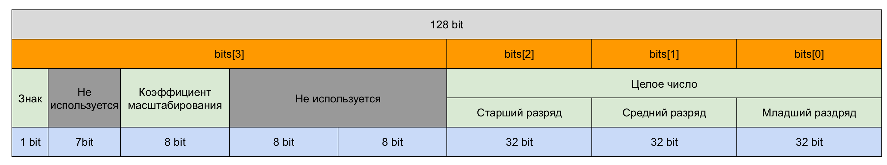

[s21_decimal @lucankri 12.02.2023](https://youtu.be/kJU4JOLa8l0)
Смотрел недавно ролик на ютубе по этой теме, в целом довольно много интересных вещей говорит лектор, однако ошибки:
1. 1:58:10 - "При переводе из дец в инт смотрим на bits[1] если там что-то есть то вовзращаем ошибку конвертации т.к число очень больше из-за того что у нас один элемент bits и есть int"
С этим не согласен, у нас же есть еще коэфицент из-за которого мы можем заполнить хоть все 3 инта и понизить их с помощью степени до вполне входящего в диапазон целых чисел значения 
### Структура заметки
- [Коротко о Decimal](#коротко%20о%20decimal)
- [Преобразования](#преобразования)
- [Арифметические операции](#арифметические%20операции)
- [Операции сравнения](#операции%20сравнения)
- [Другие функции](#операции%20сравнения)

### Коротко о Decimal
Картинка из экселя которая поможет лучше представить как устроены данные в Decimal

По этой структуре предлагается написать программу:
```c
typedef struct {
    int bits[4];
} s21_decimal;
```
Посмотрев и поработав с этим проектом я считаю что чуть удобнее будет использовать  `unsigned int`, потому что в нем не резервируется первый бит для знака числа
```c
typedef struct {
    unsigned int bits[4];
} s21_decimal;
```
### Преобразования
##### Из `int`
```c
int s21_from_int_to_decimal(int src, s21_decimal *dst)
```
Если число положительное то кладем прямо так его в `bits[0]`, если отрицательное инвертируем всего биты через `~` и прибавляем `1` тем самым мы избавимся от обратной дополненной записи и положим модуль числа. Еще если число входящее у нас отрицательное нужно выставить единицу в бите знака `s21_decimal`, для этого можно просто присвоить `bits[3]` значение равное единице.
##### Из `float`
```c
int s21_from_float_to_decimal(float src, s21_decimal *dst)
```
##### В `int`
```c
int s21_from_decimal_to_int(s21_decimal src, int *dst)
```
##### В `float`
```c
int s21_from_decimal_to_float(s21_decimal src, float *dst)
```
### Арифметические операции 
##### Сложение
```c
int s21_add(s21_decimal value_1, s21_decimal value_2, s21_decimal *result)
```
##### Вычитание
```c
int s21_sub(s21_decimal value_1, s21_decimal value_2, s21_decimal *result)
```
##### Умножение
```c
int s21_mul(s21_decimal value_1, s21_decimal value_2, s21_decimal *result)
```
##### Деление
```c
int s21_div(s21_decimal value_1, s21_decimal value_2, s21_decimal *result)
```
### Операции сравнения
##### Меньше (`<`)
```c
int s21_is_less(s21_decimal, s21_decimal)
```
##### Меньше или равно (`<=`)
```c
int s21_is_less_or_equal(s21_decimal, s21_decimal)
```
##### Больше (`>`)
```c
int s21_is_greater(s21_decimal, s21_decimal)
```
##### Больше или равно (`>=`)
```c
int s21_is_greater_or_equal(s21_decimal, s21_decimal)
```
##### Равно (`==`)
```c
int s21_is_equal(s21_decimal, s21_decimal)
```
##### Неравно (`!=`)
```c
int s21_is_not_equal(s21_decimal, s21_decimal)
```
### Другие функции
##### Округление указанного Decimal ближайшего целого числа в сторону отрицательной бесконечности
```c
int s21_floor(s21_decimal value, s21_decimal *result)
```
##### Округление Decimal до ближайшего целого числа
```c
int s21_round(s21_decimal value, s21_decimal *result)
```
##### Отбрасывание дробных цифр, включая конечные нули
```c
int s21_truncate(s21_decimal value, s21_decimal *result)
```
##### Умножение указанного Decimal на -1
```c
int s21_negate(s21_decimal value, s21_decimal *result)
```
Реализация этой функции мне кажется очень простой.
Нам нужно сменить последний бит в `bits[3]`.
Например наложив к `bits[3]` маску в виде одного бита, тем самым узнать знак.
Затем инвертировать знак через `!`. Теперь нам нужно изменить изменить значение в `bits[3]` оно будет равно себе и наложенной масске где мы из 0xFFFFFFFF вычитаем знак.
Эта маска будет содержать все единицы `-` инвертированное значение знака, тем самым запишется в `bits[3]` все биты, с измененным на противополжный 32-ым битом.

